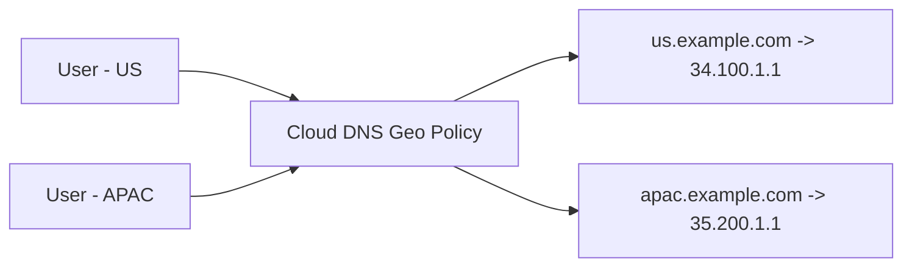
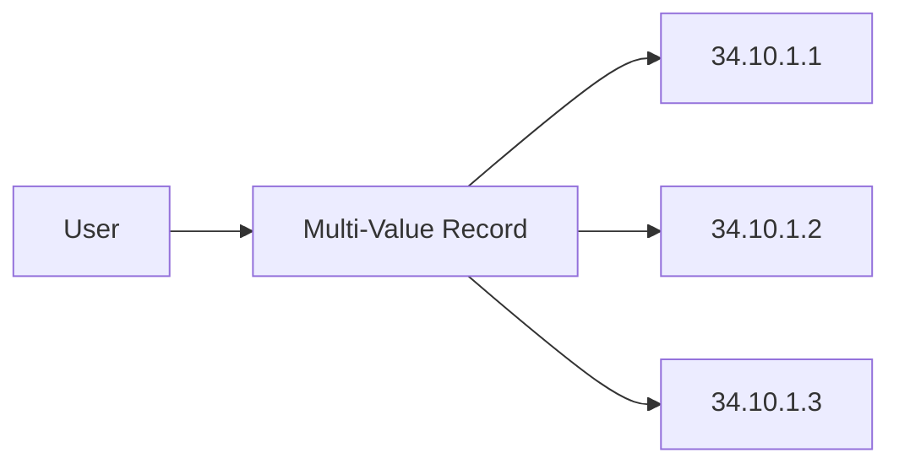
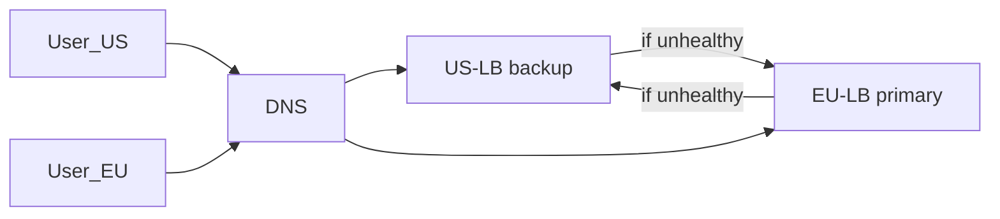

# ✅ Cloud DNS Routing Policies — Guide + Diagrams + Console Steps + Production Patterns + Interview Q&A

This document explains **Cloud DNS routing policies** in Google Cloud with:

* simple diagrams (Mermaid)
* step-by-step Console setup for each policy
* real production architecture examples
* interview-friendly questions & answers

---

## 🔎 Overview

Cloud DNS routing policies control **how DNS answers** client queries. Google Cloud supports four main routing policies:

1. **Weighted**
2. **Failover**
3. **Geolocation**
4. **Multi-value answer**

Use these policies to implement canary releases, regional routing, high-availability failover, and simple redundancy without complex application changes.

---

## 🧭 1 — Weighted Routing

**Purpose:** split traffic across multiple backends by percentage. Great for canary rollouts and A/B testing.

### Mermaid diagram

```mermaid
flowchart LR
  U[User Requests] --> DNS[Cloud DNS Weighted Record]
  DNS -->|80%| A[Backend v1 (34.10.10.10)]
  DNS -->|20%| B[Backend v2 (34.20.20.20)]
```

### When to use

* Canary deployments
* Gradual rollouts
* A/B testing features

### Console: Step-by-step

1. Console → **Network Services → Cloud DNS** → Select your zone.
2. Click **Add record set**.
3. Select **Routing policy → Weighted**.
4. Add first target IP or CNAME and set its **weight** (e.g., 80).
5. Add second target with weight (e.g., 20).
6. Save.

**Notes:** Weights are relative; Cloud DNS uses weights to approximate traffic split.

---

## 🛡️ 2 — Failover Routing

**Purpose:** send traffic to a backup when primary is unhealthy. Ideal for simple active→passive HA.

### Mermaid diagram

```mermaid
flowchart LR
  U[User] --> DNS[Cloud DNS Failover Record]
  DNS -->|Primary healthy| P[Primary (10.0.0.1)]
  DNS -->|Primary down|  B[Backup (10.1.0.1)]
```

### How it works

* Configure health checks (HTTP/TCP) pointing at your primary backend.
* Cloud DNS monitors health; if primary fails health check, responses route to backup endpoint.

### Console: Step-by-step

1. Create health checks: **Network Services → Health checks** → Create (HTTP/TCP, path, port, interval).
2. Cloud DNS → Select zone → **Add record set**.
3. Routing policy → **Failover**. Choose **Primary** and enter target (IP/endpoint).
4. Add **Backup** target and health check mapping.
5. Save.

**Notes:** Failover supports both IP and GCP load balancer backends. TTL and probe intervals affect failover speed.

---

## 🌍 3 — Geolocation Routing

**Purpose:** return different answers depending on the user’s geographic origin — used to route users to the nearest region or to serve region-specific content.

### Mermaid diagram



### When to use

* Lower latency by sending users to nearest region
* Region-specific compliance or content

### Console: Step-by-step

1. Cloud DNS → Zone → **Add record set**.
2. Choose **Routing policy → Geolocation**.
3. Select region (continent/country) and provide IP or target.
4. Repeat for other regions.
5. Optionally add a default (global) answer for unknown locations.

**Notes:** Geolocation uses client IPs from queries; use a default fallback for unknown sources.

---

## 🔁 4 — Multi-Value Answer Routing

**Purpose:** return multiple IPs in one DNS reply; Cloud DNS can remove unhealthy addresses using health checks.

### Mermaid diagram



### Use cases

* Simple redundancy without a load balancer
* Small-scale high-availability

### Console: Step-by-step

1. Cloud DNS → Zone → **Add record set**.
2. Choose **Routing policy → Multi-value**.
3. Add multiple targets (IPs or CNAMEs).
4. (Optional) Configure health checks so Cloud DNS excludes unhealthy targets.
5. Save.

**Notes:** Responses include multiple IPs; client-side selection/ordering depends on the resolver.

---

## ⚙️ Health Checks & TTL — Practical Notes

* **Health checks** determine failover and multi-value removal. Use appropriate interval and unhealthy thresholds.
* **TTL (time-to-live)** controls how long resolvers cache an answer. Short TTLs allow faster failover but increase DNS traffic.

**Recommendation:** For failover, use moderate TTL (e.g., 60–300s) and aggressive health-check interval (e.g., 5–10s) to balance speed and cost.

---

## 🏗️ Real Production Architectures (Patterns)

### Pattern A — Canary rollout with Weighted + Multi-value

* Use **Weighted** policy to route a small percent to new version.
* Use **Multi-value** behind each target group for redundancy.

Mermaid:

```mermaid
flowchart LR
  User --> DNS
  DNS -->|80%| A[v1 group (multi-value: 10 nodes)]
  DNS -->|20%| B[v2 group (multi-value: 3 nodes)]
```

### Pattern B — Regional active‑active with Geo + Failover

* Use **Geo** to send users to nearest region.
* In each region, use **Failover** policy pointing to a local LB primary and a cross-region backup.

Mermaid:



### Pattern C — Simple HA using Multi-value + health checks

* For small services without LB: Multi-value with 3 IPs and health checks to remove failed nodes.

---

## ✅ Implementation Checklist (Pre-deployment)

* [ ] Create health checks for every backend group.
* [ ] Decide TTLs per record (failover vs stable records).
* [ ] Ensure load balancer IPs are static (reserve static IPs).
* [ ] Add monitoring / logging for DNS health events.
* [ ] Test failover with controlled outages and verify TTL behavior.

---

## 🧪 Testing & Troubleshooting

* Use `dig` to inspect responses: `dig +short api.example.com @8.8.8.8`
* Inspect whether weights are approximated by repeated queries.
* Simulate health check failures and verify backup responses after TTL expires.
* Check Cloud DNS logs & health-check logs for failures.

---

## ❓ Interview Questions & Suggested Answers

**Q1. What are Cloud DNS routing policies?**
A: Policies that control how DNS responds — weighted, failover, geolocation, multi-value.

**Q2. When would you use weighted routing?**
A: For canary or A/B testing to split traffic by percentage to different backends.

**Q3. How does failover routing operate?**
A: Cloud DNS uses health checks to detect primary failure and switches DNS answers to a backup target.

**Q4. What is the difference between geo and multi-value policies?**
A: Geo responds based on client location; multi-value returns multiple IPs regardless of location.

**Q5. How can you speed up DNS failover?**
A: Use shorter TTLs and aggressive health check intervals; beware of higher DNS load.

---

## 📜 References & Links

* Cloud DNS docs: [https://cloud.google.com/dns/docs](https://cloud.google.com/dns/docs)
* Cloud Load Balancing + DNS integration: [https://cloud.google.com/load-balancing/docs](https://cloud.google.com/load-balancing/docs)

---
