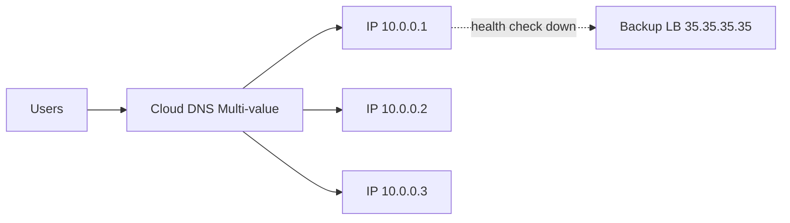

# ✅ Google Cloud Load Balancing — Complete Guide (Beginner to Advanced)

Google Cloud Load Balancing (GCLB) is a **fully managed, software-defined, global or regional load balancer** that distributes traffic across your backend services like GCE, GKE, Cloud Run, and App Engine.

It provides:

* ✅ High availability
* ✅ Auto-scaling
* ✅ Multi‑region traffic distribution
* ✅ Global Anycast IPs
* ✅ Intelligent routing
* ✅ DDoS protection (Cloud Armor)

---

# ✅ 1. Types of Google Cloud Load Balancers

## **1️⃣ Global Load Balancers (Layer 7 / HTTP(S))**

Used for **global websites or APIs**.

✅ Use cases:

* Multi‑region GKE apps
* Multi‑region Compute Engine deployments
* Cloud Run/Cloud Functions routing

✅ Features:

* Single Anycast global IP
* Traffic routed to closest healthy region

---

## **2️⃣ Regional Load Balancers (Layer 4 or Internal)**

Used inside a region or VPC.

✅ Use cases:

* Internal microservices
* Databases
* Private apps

Types:

* Internal HTTP(S) LB
* Internal TCP/UDP LB
* External TCP/UDP LB

---

# ✅ 2. Global External Application Load Balancer (GCLB)

This is the **most commonly used load balancer** for cloud-native applications.

✅ Supports:

* HTTP/HTTPS
* SSL offloading
* Cloud Armor security
* CDN integration
* Routing rules

✅ Architecture:

```
User → Global Anycast IP → Google Edge → Load Balancer → Backend Services (GKE/VM/Cloud Run)
```

---

# ✅ 3. Regional External Load Balancer

Used when you want the traffic to stay in **one region**.

✅ Supports:

* TCP/UDP load balancing
* Proxy & passthrough modes

Useful for:

* Gaming servers
* Stateful services
* Legacy applications

---

# ✅ 4. Internal Load Balancers

### **Internal HTTP(S) Load Balancer**

Traffic inside the VPC over **L7**.

### **Internal TCP/UDP Load Balancer**

Traffic inside VPC over **L4**.

✅ Used for:

* Private microservice communication
* Private API gateways
* Database frontends

---

# ✅ 5. Components of Load Balancing

| Component           | Purpose                                    |
| ------------------- | ------------------------------------------ |
| **Frontend**        | Public/Private IP, port                    |
| **URL Map**         | Routing rules (Path/Host routing)          |
| **Backend Service** | Connects to VMs / GKE / Cloud Run          |
| **Health Check**    | Detects healthy instances                  |
| **Instance Group**  | Autoscaled VM groups                       |
| **NEG**             | Network Endpoint Groups for GKE/Serverless |

---

# ✅ 6. Step-by-Step — Create Global HTTP(S) Load Balancer

### ✅ Step 1 — Create Instance Groups or GKE Service

Backend can be:

* Managed instance groups
* GKE NEG
* Cloud Run

### ✅ Step 2 — Create Load Balancer

Google Console → **Network Services → Load Balancing → Create**

Choose:
✅ **HTTP(S) External → Global**

### ✅ Step 3 — Configure Frontend

* Create **global static IP**
* Enable HTTPS (optional but recommended)

### ✅ Step 4 — Configure Backend Service

* Add instance group / NEG
* Select protocol HTTP/HTTPS
* Add health check (e.g., `/healthz`)

### ✅ Step 5 — Create URL Map

Example:

* `/api/*` → Backend A
* `/cart/*` → Backend B

### ✅ Step 6 — Review & Create

✅ Your load balancer is now live.

---

# ✅ 7. High Availability + Failover

Google Cloud Load Balancing supports:

✅ **Regional failover** (auto-routing if region is down)
✅ **Instance-level failover**
✅ **Cross-region, cross-Zone load distribution**

Example:

```
us-central1 healthy → traffic goes here
us-east1 unhealthy → traffic auto-fails to next region
```

---

# ✅ 8. Advanced Routing Features

* Path-based routing (`/api`, `/cart`)
* Host-based routing (`api.example.com`)
* Traffic splitting (A/B testing)
* Canary rollout (1% → 10% → 100%)
* Header-based routing
* GEO-based routing (via Cloud Armor rules)

---

# ✅ 9. Cloud Armor Integration

You can secure LB with WAF:

* OWASP rules
* IP allow/deny
* Bot protection
* Rate limiting
* Geo blocking

---

# ✅ 10. CDN Integration

Global Load Balancer supports:
✅ Cloud CDN for caching static & dynamic content

Reduces latency for global users.

---

# ✅ 11. Real-Time Architecture Example

### **GKE Multi-region deployment**

```
Users → Global LB → GKE us-central1
                      GKE us-east1 (Failover)
```

✅ 99.99% uptime
✅ Automatic scaling
✅ Zero downtime deployment

---

# ✅ 12. Troubleshooting Load Balancer

### ✅ Check backend health

```
gcloud compute backend-services get-health <name>
```

### ✅ Check IP mapping

```
dig +short app.example.com
```

### ✅ Check firewall rules

Health checks must be allowed.

### ✅ Check NEG status (for GKE)

```
gcloud compute network-endpoint-groups list
```

---

# ✅ 13. Beginner FAQ

### **What is the most commonly used LB?**

Global HTTP(S) Load Balancer.

### **Do LBs support autoscaling?**

Yes — they work with managed instance groups.

### **Can LB protect apps?**

Yes, using Cloud Armor.

### **Does LB work with Cloud Run?**

Yes — Cloud Run uses Serverless NEG.

---

# ✅ 14. Interview Questions

### **1. What is a Load Balancer?**

Distributes traffic across multiple backend servers.

### **2. Difference between Global & Regional LB?**

* Global → worldwide Anycast IP, multi-region
* Regional → single region

### **3. What is a NEG?**

Network Endpoint Group — connects LB to GKE/Cloud Run.

### **4. What is Path-based routing?**

Routes traffic using URL paths.

### **5. How does health check work?**

LB sends probes and removes unhealthy backends.

---

If you want:
✅ Diagrams added inside this file
✅ Examples for each LB type
✅ Terraform for load balancers
✅ Architecture for multi-region production

Just tell me!

---

## ✅ Extra Additions (Diagrams, Examples, Terraform, Multi-region Architecture)

### 📈 Diagrams (Mermaid)

**Global HTTP(S) Load Balancer (Anycast) — Diagram**

```mermaid
flowchart LR
  Internet[Users Worldwide] -->|DNS Anycast| Edge[Google Edge POPs]
  Edge --> LB[Global HTTP(S) Load Balancer]
  LB --> BackendUS[GKE us-central1]
  LB --> BackendEU[GKE europe-west1]
  LB --> BackendAPAC[GKE asia-south1]
```

**Internal HTTP(S) Load Balancer — Diagram**

```mermaid
flowchart LR
  InternalClient[App inside VPC] --> ILB[Internal HTTP(S) Load Balancer]
  ILB --> BackendGroup[Managed Instance Group (private)]
```

**Multi-value + Failover Example — Diagram**



---

### 🧩 Concrete Examples (per LB type)

**Global External HTTP(S) Load Balancer (Example)**

* Use Case: Public website + API distributed across regions.
* Backend: Serverless NEGs (Cloud Run) in `us-central1` and `europe-west1`.
* Routing: Path-based (`/api/*` → API backends, `/` → frontend).
* Health check: HTTP `/healthz` on port 8080, interval 5s, unhealthy threshold 2.

**Regional TCP/UDP Load Balancer (Example)**

* Use Case: Game servers or stateful TCP services.
* Backend: Managed instance group in `asia-south1`.
* Health check: TCP port probe interval 10s.

**Internal HTTP(S) Load Balancer (Example)**

* Use Case: Microservices internal API gateway.
* Backend: Internal NEG attached to GKE node pools in same VPC.
* Access: Private IP only, controlled via firewall tags.

**Network Endpoint Group (NEG) for Cloud Run (Example)**

* Use Case: Expose Cloud Run service behind global LB.
* Create serverless NEG referencing Cloud Run service and attach to backend service.

---

### ⚙️ Terraform Examples (Minimal snippets)

**1) Global HTTP(S) Load Balancer (Static IP + Backend service)**

```hcl
resource "google_compute_global_address" "lb_ip" {
  name = "global-lb-ip"
}

resource "google_compute_backend_service" "default" {
  name                  = "backend-service"
  protocol              = "HTTP"
  connection_draining {
    draining_timeout_sec = 300
  }
}

# URL map, target proxy, forwarding rule omitted for brevity — GCP docs show full config
```

**2) Internal HTTP(S) Load Balancer (Regional)**

```hcl
resource "google_compute_region_backend_service" "internal" {
  name     = "internal-backend"
  protocol = "HTTP"
  health_checks = [google_compute_health_check.internal.name]
}

resource "google_compute_forwarding_rule" "internal_fr" {
  name       = "internal-fr"
  region     = var.region
  ip_address = google_compute_address.internal_ip.address
  ip_protocol = "TCP"
  ports = ["80"]
  backend_service = google_compute_region_backend_service.internal.id
}
```

**3) Serverless NEG for Cloud Run (Terraform reference)**

```hcl
resource "google_compute_region_network_endpoint_group" "serverless_neg" {
  name = "cloudrun-neg"
  network_endpoint_type = "SERVERLESS"
  cloud_run {
    service = "my-cloudrun-service"
  }
  region = var.region
}
```

> Note: these snippets are minimal — full LB requires URL map, target proxy, forwarding rule and IAM permissions. I can generate full-ready Terraform modules on request.

---

### 🏗️ Multi-Region Production Architecture (Pattern)

**Goal:** Low latency, high availability, zero-downtime deploys.

1. **Deploy identical backends** in multiple regions (GKE clusters or managed instance groups).
2. **Use Global HTTP(S) Load Balancer** with a single Anycast IP — traffic is routed to nearest healthy region.
3. **Enable Cloud CDN** for static assets to reduce origin load.
4. **Use Health Checks** per backend to enable automatic cross-region failover.
5. **Use Cloud DNS Geo or Failover policies** only if you need custom control beyond GCLB.
6. **Data layer:** Prefer globally-distributed services (Cloud Spanner) or async replication for databases.

**Diagram (Mermaid)**

```mermaid
flowchart LR
  Users -->|DNS Anycast| Edge[Google Edge]
  Edge --> GCLB[Global HTTP(S) LB]
  GCLB --> Region1[GKE us-central1]
  GCLB --> Region2[GKE europe-west1]
  GCLB --> Region3[GKE asia-south1]
  Region1 --> CloudSQL1[Cloud SQL (replica)]
  Region2 --> CloudSQL2[Cloud SQL (replica)]
  Replicas -->|async| PrimaryDB[Primary Cloud SQL or Spanner]
```

---

### ✅ Interview Questions (with short answers)

**Q1. What is the difference between Global and Regional load balancer?**
A: Global LB uses Anycast IP and routes traffic to the closest healthy region; Regional LB serves traffic within a single region.

**Q2. What is a NEG and when do you use it?**
A: Network Endpoint Group — connects load balancers to endpoints (VMs, GKE pods, Cloud Run). Use NEGs for precise backend mapping and serverless integration.

**Q3. How do health checks affect failover?**
A: Health checks determine backend health; when unhealthy, LB removes the backend and fails over to healthy backends. Check interval and thresholds control detection speed.

**Q4. How to secure a Load Balancer?**
A: Use Cloud Armor (WAF), HTTPS with TLS certs, IAM on backend services, private backends, and firewall rules.

**Q5. How to do zero-downtime deployments?**
A: Use server groups or GKE rolling updates + gradual traffic split (traffic shaping with URL maps/weighted policies) and health checks to detect issues.

---
