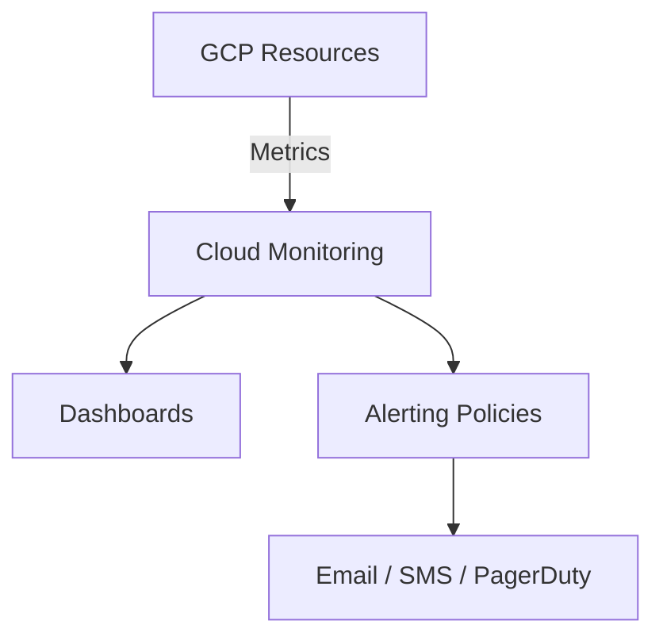

# ✅ Google Cloud Monitoring (Stackdriver)


---

## ✅ 1. What is Cloud Monitoring?

Google Cloud Monitoring helps you **watch your resources** like:

* VM instances
* GKE clusters
* Cloud SQL
* Load balancers
* Cloud Functions
* Custom applications

It shows:

* CPU / Memory / Disk
* Errors
* Logs
* Alerts
* Dashboards

📌 **Real Example:**
"If your VM CPU goes above 80%, Cloud Monitoring can send you an email alert."

---

## ✅ 2. How Cloud Monitoring Works (Very Easy Explanation)

1. GCP services generate metrics (CPU, memory, latency…).
2. Cloud Monitoring collects these metrics.
3. You can view them in dashboards.
4. You can create **alerts** if something goes wrong.

💡 Think of Cloud Monitoring like a **health report** for your cloud systems.

---

## ✅ 3. Enable Cloud Monitoring

Cloud Monitoring is enabled automatically for all projects.

To open it:
**Console → Monitoring**

---

## ✅ 4. Create a Monitoring Workspace (First Time)

1. Go to **Monitoring**
2. Click **Create Workspace**
3. Choose the project and click **Confirm**

✅ Done!

---

## ✅ 5. View Metrics (CPU, Disk, Memory)

1. Go to **Monitoring → Metrics Explorer**
2. Choose a resource type (Example: `VM Instance`)
3. Choose a metric (Example: `CPU utilization`)
4. A graph will appear ✅

📌 **Real Example:**
You can see your VM CPU usage in real time.

---

## ✅ 6. Create Dashboards (Custom UI)

Dashboards help you see metrics in one place.

### Steps:

1. Monitoring → **Dashboards**
2. Click **Create Dashboard**
3. Add a chart → choose metric → save

📌 **Real Example:**
A GKE dashboard showing:

* Node CPU
* Pod restarts
* Deployment latency

---

## ✅ 7. Create Alerts (VERY IMPORTANT)

Alerts notify you when something goes wrong.

### Example Alert: VM CPU > 80%

1. Monitoring → **Alerting**
2. Click **Create Policy**
3. Add Condition → Metric → `CPU Utilization`
4. Condition → greater than **80%**
5. Add notification channel:

   * Email
   * SMS
   * Slack
   * PagerDuty
6. Click **Save** ✅

📌 **Real Example:**
You get an email:
"Your VM instance cpu-high is above 80% for 5 minutes."

---

## ✅ 8. Notification Channels

You can connect Cloud Monitoring to:

* Gmail / Email
* SMS
* Slack
* PagerDuty
* Webhooks

### Steps:

Monitoring → Alerting → **Notification channels**

---

## ✅ 9. Uptime Checks (Website Monitoring)

Uptime checks verify your website is working.

### Example: Monitor a Web App

1. Monitoring → **Uptime Checks**
2. Add New
3. Enter URL → `https://myapp.com`
4. Set frequency → 1 minute
5. Save

If site goes down → you get alert.

---

## ✅ 10. Logs + Metrics Together (Super Useful)

Cloud Monitoring works together with **Cloud Logging**.

Example:

* Pod crashes → Logs show error
* Monitoring graph shows spike

This helps fast troubleshooting.

---

## ✅ 11. Custom Metrics (For Your Applications)

You can push your own metrics:

* Number of orders
* Number of logins
* Queue size

Example Python:

```python
from google.cloud import monitoring_v3
client = monitoring_v3.MetricServiceClient()
```

---

## ✅ 12. Real-Time Use Case

### E‑commerce app on GKE:

Monitoring tracks:

* CPU spikes when users increase
* Pod restarts
* Response time of checkout API
* Errors per second

Alerts:

* Checkout API latency > 500ms
* Pod restarts more than 5 times
* GKE nodes low on memory

---

## ✅ 13. Best Practices

✅ Create dashboards for each environment (Dev/QA/Prod)
✅ Set alerts for critical resources
✅ Use uptime checks for public apps
✅ Export logs to BigQuery for analysis
✅ Turn on latency/error monitoring for APIs

---

## ✅ 14. Troubleshooting (Easy)

❌ **Alert not triggering**
→ Your condition or threshold may be wrong.

❌ **No metrics visible**
→ Enable Monitoring API.

❌ **Charts empty**
→ Change time range (Last 1h → Last 30 days).

---

## ✅ Want to add more?

I can include:
✅ Monitoring diagrams (Mermaid)
✅ GKE cluster monitoring guide
✅ Cloud SQL monitoring guide
✅ Alerting best practices for production
✅ Terraform for dashboards + alerts
✅ Interview questions

## 📊 Monitoring Diagrams (Mermaid)



## 🟦 GKE Cluster Monitoring (Step-by-Step)

1. **Enable GKE Monitoring** during cluster creation (`Enable Cloud Ops`)
2. Install **Cloud Ops Agent** (automatically managed by GKE)
3. View cluster dashboards:

   * Kubernetes Overview
   * Node CPU/Memory usage
   * Pod/Container metrics
   * Network traffic
4. Create Alerts for:

   * Node CPU > 80%
   * Pod restarts > 5 times in 10 minutes
   * Deployment replicas < desired count
5. Use **Cloud Logging** for troubleshooting (`kubectl logs` + GCP logs)

✅ Real Example:
A payment microservice keeps restarting. Cloud Monitoring shows high memory usage on a specific node → auto upgrade node pool → issue fixed.

## 🟨 Cloud SQL Monitoring (Step-by-Step)

1. Open **SQL → Instance → Monitoring tab**
2. Key metrics to monitor:

   * CPU Utilization
   * Memory Utilization
   * Storage Used %
   * Connection Count
   * Replication Lag
3. Create Alerts:

   * Storage > 90%
   * Connections > 80% of limit
   * High CPU > 70% for 10 minutes
4. Enable **Query Insights** (for MySQL/Postgres)
5. Export logs to Cloud Logging for deeper investigation

✅ Real Example:
Database CPU spikes → Query Insights shows heavy SELECT queries → developer optimizes query → CPU comes back to normal.

## 🔔 Alerting Best Practices for Production

✅ Create alerts only for important metrics
✅ Use **notification channels** like PagerDuty, Slack
✅ Use **Policies with auto close** to avoid alert fatigue
✅ Add **cool-down period** to prevent repeated alerts
✅ Use **Multi-condition alerts** (CPU + Latency together)

✅ Example:
"Trigger alert if CPU > 80% AND request latency > 200ms for 5 min"

## 🧩 Terraform Example — Create Dashboard + Alert

```hcl
resource "google_monitoring_dashboard" "gke_dashboard" {
  dashboard_json = <<EOF
{
  "displayName": "GKE Cluster Dashboard",
  "gridLayout": {
    "widgets": [
      {
        "title": "CPU Usage",
        "xyChart": {
          "dataSets": [
            {
              "timeSeriesQuery": {
                "timeSeriesFilter": {
                  "filter": "metric.type=\"kubernetes.io/node/cpu/usage_time\""
                }
              }
            }
          ]
        }
      }
    ]
  }
}
EOF
}

resource "google_monitoring_alert_policy" "high_cpu" {
  display_name = "High CPU Alert"
  combiner     = "OR"

  conditions {
    display_name = "CPU > 80%"
    condition_threshold {
      filter   = "metric.type=\"compute.googleapis.com/instance/cpu/utilization\""
      comparison = "COMPARISON_GT"
      threshold_value = 0.8
      duration = "300s"
    }
  }
}
```

## ✅ Interview Questions (with answers)

**1. What is Cloud Monitoring?**
It’s a service to collect metrics, logs, uptime data, and create dashboards & alerts.

**2. What is the difference between Metrics & Logs?**
Metrics = numeric values (CPU, memory)
Logs = text events (errors, warnings)

**3. What is an Alert Policy?**
A rule that triggers notifications when metric conditions are met.

**4. What is SLI, SLO, SLA?**

* **SLI:** Measurement (e.g., latency < 200ms)
* **SLO:** Target (e.g., 99% requests < 200ms)
* **SLA:** Contract with customer

**5. How does Cloud Monitoring collect GKE metrics?**
Using Google-managed Ops Agent inside nodes.

**6. How to monitor Cloud SQL performance?**
Use dashboard + Query Insights + alerting on CPU/memory/storage.

**7. What is Uptime Check?**
A way to check if a service/URL is reachable globally.

**8. How to monitor VM logs & metrics?**
Install Ops Agent → metrics + logs flow to Cloud Monitoring.

**9. What is an Incident in Cloud Monitoring?**
An alert that has been triggered and is currently active.

**10. Why use dashboards?**
To visualize system health and quickly spot performance issues.
