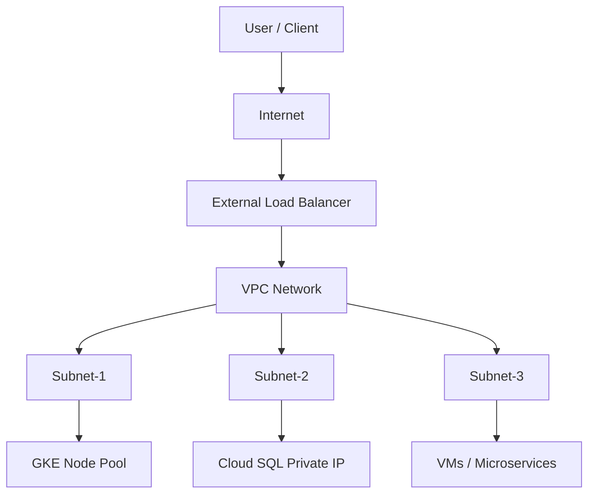
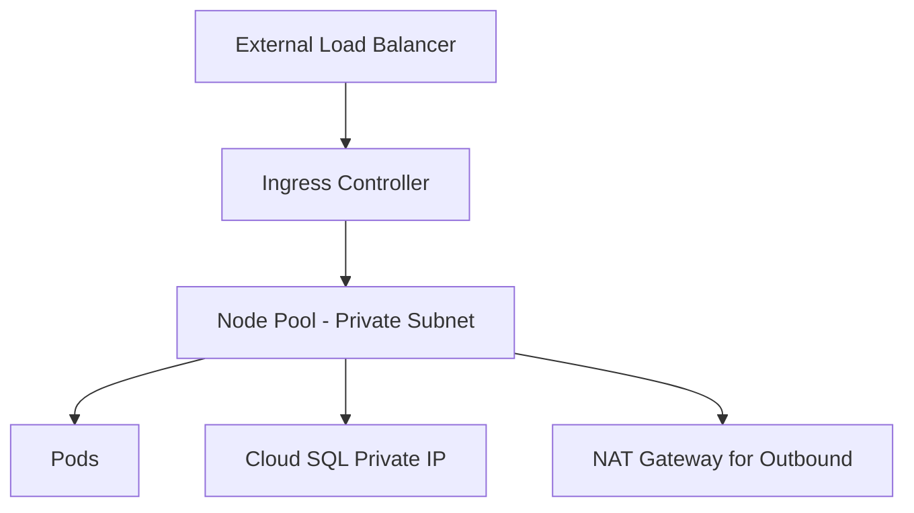

# ✅ GCP VPC – Complete & Beginner‑Friendly Guide

This guide explains **VPC networking in GCP** in the simplest and clearest way possible — with diagrams, real-time examples, GKE architecture, Cloud SQL private IP setup, and interview questions.

---

GCP VPC Full Console‑Based Guide

This document explains **every VPC networking task in Google Cloud Console (UI only)**.
No CLI commands. 100% Console.

It covers:
✅ VPC creation
✅ Subnets
✅ Firewall rules
✅ Cloud Router, Cloud NAT
✅ Peering
✅ Shared VPC
✅ Serverless VPC Access
✅ Private Google Access
✅ VPC Flow Logs

---

# ✅ 1. What is a VPC? (Console Overview)

A **Virtual Private Cloud (VPC)** is your private network inside Google Cloud. It contains:

* **Subnets** (ranges of IPs)
* **Firewall rules**
* **Routes**
* **Cloud Router / Cloud NAT**
* **VPC Peering**
* **VPN / Interconnect**

Go to Console → **VPC Network**

---

# ✅ 2. Create a New VPC (Console)

1. Console → **VPC Network → VPC Networks**
2. Click **Create VPC Network**
3. Fill:

   * **Name**: `my-vpc`
   * **Subnets**: Choose “Custom” (recommended)
4. Add subnets:

   * Click **Add Subnet**
   * Name: `subnet-1`
   * Region: `asia-south1`
   * IP range: `10.0.0.0/24`
5. Add more subnets per region if needed
6. Click **Create**

✅ VPC created.

---

# ✅ 3. Create Additional Subnets (Console)

1. Console → **VPC Network → VPC Networks**
2. Click your VPC `my-vpc`
3. Go to **Subnets** tab
4. Click **Add Subnet**
5. Fill:

   * Name: `subnet-dev`
   * Region: `us-central1`
   * Range: `10.0.1.0/24`
6. Save

✅ Subnet added.

---

# ✅ 4. Configure Firewall Rules (Console)

Firewall rules allow/deny traffic.

### Create a firewall rule

1. Console → **VPC Network → Firewall**
2. Click **Create Firewall Rule**
3. Fill:

   * Name: `allow-ssh`
   * Network: `my-vpc`
   * Direction: **Ingress**
   * Targets: **All instances** or specific tags
   * Source IP: `0.0.0.0/0` *(not recommended for prod)*
   * Protocols/ports: `tcp:22`
4. Click **Create**

✅ SSH rule created.

---

# ✅ 5. Create a Cloud Router (Console)

Cloud Router is required for:

* Cloud NAT
* VPN dynamic routing

1. Console → **Hybrid Connectivity → Cloud Routers**
2. Click **Create Router**
3. Fill:

   * Name: `my-router`
   * Network: `my-vpc`
   * Region: `asia-south1`
4. Click **Create**

✅ Router created.

---

# ✅ 6. Create Cloud NAT (Console)

Cloud NAT gives private VMs outbound internet WITHOUT public IPs.

1. Console → **VPC Network → NAT**
2. Click **Create NAT Gateway**
3. Fill:

   * Name: `my-nat`
   * Router: `my-router`
4. NAT Mapping:

   * Select **Manual** or **Auto** IP allocation
5. Click **Create**

✅ NAT created.

---

# ✅ 7. Enable Private Google Access (PGA)

Allows private-only VMs to access Google APIs.

1. Console → **VPC Network → Subnets**
2. Click a subnet → **Edit**
3. Scroll to **Private Google Access**
4. Turn **ON**
5. Save

✅ Subnet can now reach GCP APIs privately.

---

# ✅ 8. Enable VPC Flow Logs

Flow logs show traffic for debugging.

1. Console → **VPC Network → Subnets**
2. Select a subnet → **Edit**
3. Scroll to **Flow Logs**
4. Turn **ON**
5. Save

✅ Flow logs enabled → visible in Cloud Logging.

---

# ✅ 9. Create VPC Peering (Console)

Peering connects two VPCs.

1. Console → **VPC Network → VPC Network Peering**
2. Click **Create Connection**
3. Fill for VPC-A:

   * Name: `peer-a-b`
   * VPC Network: `vpc-a`
   * Peer Project ID: `YOUR_PROJECT_ID`
   * Peer VPC Network Name: `vpc-b`
4. Click **Create**

➡️ Do the same from VPC‑B side.

✅ Peering active when both sides created.

---

# ✅ 10. Shared VPC Setup (Console)

Shared VPC allows one **Host Project** to share networks with **Service Projects**.

### 10.1 Enable Host Project

1. Console → **VPC Network → Shared VPC**
2. Click **Set up Shared VPC**
3. Select your project → Enable

### 10.2 Add Service Projects

1. Shared VPC → **Service Projects**
2. Click **Add**
3. Select project to attach
4. Save

### 10.3 Assign IAM roles

* Network User
* Security Admin (optional)

✅ Service project resources can now attach to host VPC.

---

# ✅ 11. Serverless VPC Access (Console)

Required for:

* Cloud Run → VPC
* Cloud Functions → VPC
* App Engine → VPC

1. Console → **VPC Network → Serverless VPC Access**
2. Click **Create Connector**
3. Fill:

   * Name: `connector-1`
   * Region: `asia-south1`
   * Network: `my-vpc`
   * IP Range: `10.8.0.0/28`
4. Create

✅ Your Cloud Run/Functions can access internal resources.

---

# ✅ 12. Routes in VPC (Console)

1. Console → **VPC Network → Routes**
2. View default routes:

   * `0.0.0.0/0 → default internet gateway`
   * `10.0.0.0/24 → your subnet`
3. Custom routes can be added via VPN/Router

✅ Routing is auto-managed unless using advanced configs.

---

# ✅ 13. Useful Architecture Patterns

### 🔹 Pattern 1 — Private VMs with Internet (Cloud NAT)

* No external IP
* Access to internet via NAT
* Secure, cost efficient

### 🔹 Pattern 2 — Shared VPC for enterprise

* Host project: networking only
* Service projects: workloads

### 🔹 Pattern 3 — Global VPC

* Subnets across regions
* Low latency internal communication

---

# ✅ 14. Best Practices

* Use **Custom** subnets, not Auto mode
* Always enable **Flow Logs** for troubleshooting
* Use **tags** and **service accounts** in firewall rules
* Prefer Cloud NAT over external IPs
* Use Shared VPC for multi-project setups
* Enable PGA for private workloads

---

# ✅ 15. End of Guide

This **100% Console‑based VPC guide** covers:
✅ VPC creation
✅ Subnets
✅ Firewall
✅ NAT
✅ Router
✅ VPC Peering
✅ Private Google Access
✅ Flow Logs
✅ Serverless Access
✅ Shared VPC

If you want, I can add:
✅ VPC diagrams (Mermaid)
✅ Real interview questions
✅ Real-time architecture examples
✅ GKE VPC design
✅ Cloud SQL private IP setup

## ✅ VPC Diagrams (Mermaid)



---

## ✅ Real Interview Questions

1. What is the difference between **VPC** and **Subnet** in GCP?
2. How does **Firewall rule priority** work?
3. What is the purpose of **Cloud Router**?
4. Why do we use a **NAT Gateway** in private subnets?
5. Explain **Shared VPC** architecture.
6. How do you connect GKE to Cloud SQL securely?
7. What is VPC Peering and its limitations?
8. When would you choose **Private Service Connect**?
9. How do **routes** work inside a VPC?
10. What is the difference between **internal** and **external** load balancers?

---

## ✅ Real-Time Architecture Example (Production Setup)

```
VPC: production-vpc
Subnets:
  - public-subnet (10.10.1.0/24)
  - private-subnet-gke (10.10.2.0/24)
  - private-subnet-sql (10.10.3.0/24)

Workloads:
  - GKE cluster in private-subnet-gke
  - Cloud SQL (Private IP) in private-subnet-sql
  - NAT Gateway in public-subnet for outbound traffic
  - Load Balancer for ingress traffic
```

GKE nodes have **no public IP**, and outbound traffic flows through **NAT Gateway**. Cloud SQL is accessible only using **Private IP**.

---

## ✅ GKE VPC Design

* Create a **Custom VPC**.
* Create **2 or 3 private subnets** for GKE nodes.
* Enable **VPC-native (Alias IP)** mode for Pod IP allocation.
* Add **Cloud NAT** for outbound internet.
* Use **Firewall rules** to allow:

  * Node → Master (443)
  * Pod → Database (3306 for MySQL)
* Use **Internal Load Balancer** for microservices.
* Use **External Load Balancer** only for frontend ingress.

Diagram:



---

## ✅ Cloud SQL Private IP Setup (Step-by-Step)

1. Create a **Custom VPC**.
2. Create a **Private Subnet** for database.
3. Enable **Private Service Access**:

   ```bash
   ```

gcloud compute addresses create google-managed-services --global --purpose=VPC_PEERING --addresses=10.10.4.0 --prefix-length=24 --network=production-vpc

````
4. Create VPC peering:
```bash
gcloud services vpc-peerings connect --service=servicenetworking.googleapis.com --network=production-vpc
````

5. Create Cloud SQL instance with **Private IP only**.
6. Connect from GKE using **private IP** and **Cloud SQL Auth Proxy**.

---
